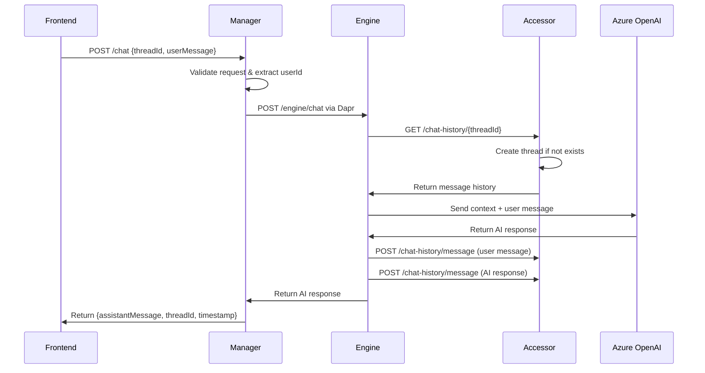

# Design Document

## Overview

The basic chat functionality feature implements a synchronous chat system that enables frontend applications to communicate with an AI assistant through a three-tier microservices architecture. The system follows the existing architectural patterns in the codebase, utilizing Dapr for service communication, Entity Framework for data persistence, and Azure OpenAI for AI responses.

The design leverages the current service structure:
- **Manager Service**: Acts as the API gateway, handling HTTP requests from frontend and orchestrating communication between services
- **Engine Service**: Processes AI requests, manages conversation context, and interfaces with Azure OpenAI
- **Accessor Service**: Provides data persistence for chat threads and messages using PostgreSQL

## Architecture

### High-Level Flow



### Service Communication

The system uses synchronous HTTP communication via Dapr service invocation, following the existing pattern in the codebase. This aligns with the requirement for synchronous flow in the first version.

### Data Flow Architecture

1. **Request Validation**: Manager service validates incoming requests and extracts user context
2. **Context Retrieval**: Engine service fetches conversation history from Accessor
3. **AI Processing**: Engine service constructs context and calls Azure OpenAI
4. **Data Persistence**: Engine service stores both user and AI messages
5. **Response Delivery**: Synchronous response chain back to frontend

## Components and Interfaces

### Manager Service Components

#### ChatEndpoints
- **POST /chat**: Primary chat endpoint for sending messages
- **GET /chat/threads**: Retrieve user's chat threads
- Follows existing endpoint pattern with proper logging and error handling

#### ChatService
- Orchestrates chat flow between Engine and frontend
- Handles request validation and user context extraction
- Manages error scenarios and response formatting

### Engine Service Components

#### ChatEngineService
- Processes chat requests from Manager
- Retrieves conversation history from Accessor
- Interfaces with Azure OpenAI using existing Semantic Kernel integration
- Stores conversation messages via Accessor

#### ChatHistoryManager
- Manages conversation context and history formatting
- Handles thread creation and message ordering
- Formats messages for OpenAI API consumption

### Accessor Service Components

#### ChatRepository
- Implements data access patterns for chat entities
- Handles thread and message CRUD operations
- Manages automatic thread creation

#### Chat Data Models
- **ChatThread**: Represents conversation threads
- **ChatMessage**: Represents individual messages in conversations
- Follows existing Entity Framework patterns

## Data Models

### ChatThread Entity
```csharp
[Table("ChatThreads")]
public record ChatThread
{
    [Key]
    public string ThreadId { get; set; } = string.Empty;
    
    [Required]
    public string UserId { get; set; } = string.Empty;
    
    [Required]
    public string ChatType { get; set; } = "default";
    
    [Required]
    public DateTime CreatedAt { get; set; }
    
    [Required]
    public DateTime UpdatedAt { get; set; }
    
    // Navigation property
    public virtual ICollection<ChatMessage> Messages { get; set; } = new List<ChatMessage>();
}
```

### ChatMessage Entity
```csharp
[Table("ChatMessages")]
public record ChatMessage
{
    [Key]
    public string Id { get; set; } = Guid.NewGuid().ToString();
    
    [Required]
    public string ThreadId { get; set; } = string.Empty;
    
    [Required]
    public string Role { get; set; } = string.Empty; // user, assistant, system
    
    [Required]
    public string Content { get; set; } = string.Empty;
    
    [Required]
    public DateTime Timestamp { get; set; }
    
    // Navigation property
    public virtual ChatThread Thread { get; set; } = null!;
}
```

### Request/Response Models

#### ChatRequest (Manager)
```csharp
public sealed record ChatRequest
{
    [Required]
    public string ThreadId { get; init; } = string.Empty;
    
    [Required]
    [MinLength(1)]
    public string UserMessage { get; init; } = string.Empty;
    
    public DateTime Timestamp { get; init; } = DateTime.UtcNow;
}
```

#### ChatResponse (Manager)
```csharp
public sealed record ChatResponse
{
    public string AssistantMessage { get; init; } = string.Empty;
    public string ThreadId { get; init; } = string.Empty;
    public DateTime Timestamp { get; init; } = DateTime.UtcNow;
}
```

#### ThreadsResponse (Manager)
```csharp
public sealed record ThreadsResponse
{
    public List<ThreadSummary> Threads { get; init; } = new();
}

public sealed record ThreadSummary
{
    public string ThreadId { get; init; } = string.Empty;
    public string LastMessage { get; init; } = string.Empty;
    public DateTime Timestamp { get; init; }
}
```

## Error Handling

### Error Response Strategy
Following the existing pattern in the codebase, all endpoints return structured error responses:

```csharp
// Validation errors
Results.BadRequest(new { errors = validationErrors });

// Service unavailable
Results.Problem("Service temporarily unavailable", statusCode: 503);

// OpenAI API failures
Results.Problem("AI service error", statusCode: 502);

// Database errors
Results.Problem("Internal server error", statusCode: 500);
```

### Error Scenarios
1. **Invalid Request Format**: Return 400 with validation details
2. **Service Communication Failures**: Return 503 with retry guidance
3. **OpenAI API Errors**: Return 502 with appropriate error message
4. **Database Connection Issues**: Return 500 with generic error message
5. **Thread Not Found**: Automatically create new thread (graceful handling)

### Logging Strategy
Implement structured logging following existing patterns:
- Use `BeginScope` for request correlation
- Log at appropriate levels (Information, Warning, Error)
- Include relevant context (threadId, userId, requestId)

## Testing Strategy

### Unit Testing
- **Manager Service**: Test endpoint validation, service orchestration, error handling
- **Engine Service**: Test AI processing logic, history management, message storage
- **Accessor Service**: Test repository operations, data model validation, database interactions

### Integration Testing
- **Service Communication**: Test Dapr service invocation between components
- **Database Operations**: Test Entity Framework operations with test database
- **OpenAI Integration**: Test with mock OpenAI responses

### Component Testing
- **End-to-End Chat Flow**: Test complete chat conversation flow
- **Thread Management**: Test thread creation and retrieval
- **Error Scenarios**: Test various failure modes and recovery

### Test Data Management
- Use in-memory database for unit tests
- Create test fixtures for chat threads and messages
- Mock external dependencies (OpenAI, Dapr)

## Database Schema Changes

### Migration Strategy
1. Create new migration for ChatThread and ChatMessage entities
2. Add foreign key relationships and indexes
3. Ensure backward compatibility with existing schema

### Indexes
```sql
-- Performance indexes for common queries
CREATE INDEX IX_ChatMessages_ThreadId ON ChatMessages(ThreadId);
CREATE INDEX IX_ChatMessages_Timestamp ON ChatMessages(Timestamp);
CREATE INDEX IX_ChatThreads_UserId ON ChatThreads(UserId);
CREATE INDEX IX_ChatThreads_UpdatedAt ON ChatThreads(UpdatedAt);
```

## Configuration

### Manager Service Configuration
```json
{
  "Chat": {
    "MaxMessageLength": 4000,
    "DefaultTimeout": 30000
  }
}
```

### Engine Service Configuration
```json
{
  "Chat": {
    "MaxHistoryMessages": 20,
    "SystemPrompt": "You are a helpful assistant."
  }
}
```

## Security Considerations

### Authentication
- Extract userId from JWT token (empty for first version)
- Validate user permissions for thread access
- Implement rate limiting for chat endpoints

### Data Protection
- Sanitize user input to prevent injection attacks
- Encrypt sensitive data in database
- Implement audit logging for chat interactions

### API Security
- Validate all input parameters
- Implement request size limits
- Use HTTPS for all communications