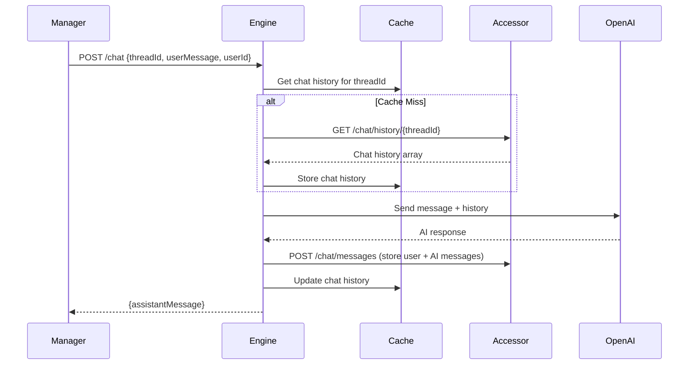

# Design Document

## Overview

This design implements a synchronous chat endpoint in the Engine service that provides immediate responses to chat requests from the Manager service. The solution leverages existing OpenAI integration through the ChatAiService while adding chat history persistence via the Accessor service.

The endpoint follows the existing architectural patterns in the Engine service, reusing the current ChatAiService and extending the DTOs to include userId for proper message attribution.

## Architecture

### High-Level Flow



### Component Integration

- **ChatAiService**: Reused for OpenAI communication with chat history context
- **AiEndpoints**: Enhanced to handle the new request format with userId and chat history
- **Dapr Client**: Used for Accessor service communication to retrieve history and save Q&A pairs

## Components and Interfaces

### 1. Enhanced DTOs

**ChatRequestDto** (Modified)
```csharp
public sealed record ChatRequestDto(
    string ThreadId,
    string UserMessage,
    string UserId,
    string ChatType = "default"
);
```

**New DTOs for Accessor Communication**
```csharp
public sealed record ChatMessage(
    string ThreadId,
    string UserId,
    string Message,
    string Role, // "user" or "assistant"
    DateTime Timestamp
);

public sealed record ChatHistoryResponse(
    string ThreadId,
    List<ChatMessage> Messages
);

public sealed record StoreChatMessagesRequest(
    string ThreadId,
    string UserId,
    string UserMessage,
    string AssistantMessage
);
```

### 2. ChatAiService Integration

The existing ChatAiService will be used without modification, leveraging the current ProcessAsync method for OpenAI communication. The chat history will be integrated by converting the retrieved messages into the existing AiRequestModel format before calling the service.
```csharp
// No interface changes required - using existing IChatAiService
public interface IChatAiService
{
    Task<AiResponseModel> ProcessAsync(AiRequestModel request, CancellationToken ct = default);
}
```

### 3. Accessor Client for Engine

A new client service for Engine to communicate with Accessor:

```csharp
public interface IAccessorClient
{
    Task<ChatHistoryResponse?> GetChatHistoryAsync(string threadId);
    Task<bool> StoreChatMessagesAsync(StoreChatMessagesRequest request);
}
```

### 4. Enhanced AiEndpoints

The existing `/chat` endpoint will be updated to handle the new request format and implement the full flow.


## Error Handling

### Error Scenarios and Responses

1. **Validation Errors** (400 Bad Request)
   - Missing required fields (threadId, userMessage, userId)
   - Invalid field formats

2. **Accessor Service Unavailable** (500 Internal Server Error)
   - Return error response with status 500
   - Return message "we are currently facing problems"
   - Do not proceed with OpenAI call or message processing

3. **OpenAI API Failures** (500 Internal Server Error)
   - Return internal server error response when any error is caught in the endpoint
   - Log detailed error information for debugging and monitoring

### Error Response Format

```json
{
  "error": "Error description",
  "details": "Additional error context",
  "timestamp": "2025-01-06T10:30:00Z"
}
```

## Testing Strategy

*Testing will be implemented after the complete solution is in place*
## Implementation Notes

### Reuse of Existing Code

- **ChatAiService**: The existing ProcessAsync method logic will be extracted into shared methods for OpenAI communication
- **Cache Management**: Existing cache patterns and configuration will be reused
- **Error Handling**: Existing retry policies and error logging patterns will be applied
- **Dapr Integration**: Existing Dapr client configuration and patterns will be used

### Configuration

No new configuration required - the solution uses existing:
- Azure OpenAI settings
- Cache configuration
- Dapr service discovery
- Logging configuration

### Performance Considerations

*Performance considerations will be implemented after the complete solution is in place*
