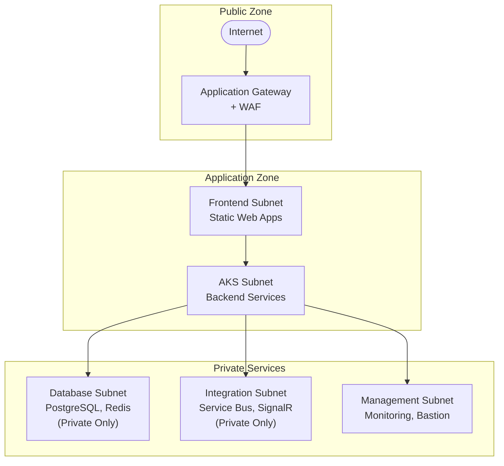

# Azure Network Architecture Plan

## 1. Current State

- Multiple Azure resources (AKS, PostgreSQL, Service Bus, SignalR, WebApps) are deployed.
- Some resources may be using public endpoints, increasing exposure to threats.
- Network segmentation and security controls (NSGs, Private Endpoints) may not be fully implemented.
- Frontend and backend services may not be optimally isolated, risking lateral movement in case of compromise.

---

## 2. Target Architecture Overview

- **Single Azure Virtual Network (VNet)** with multiple subnets for strict isolation.
- **Network Security Groups (NSGs)** applied to each subnet for granular access control.
- **Private Endpoints** for all PaaS services (PostgreSQL, Service Bus, SignalR, etc.).
- **Application Gateway with WAF** as the only public entry point.
- **Frontend** exposed securely; all other components are private and accessible only within the VNet.

---

## 3. Architecture Diagram

```mermaid
flowchart TB
  %% ========= HIERARCHY INSIDE RESOURCE GROUP =========
  subgraph RG["Resource Group: ${environment}-${rg_name}"]
    direction TB

    %% ========= VNET & SUBNETS =========
    subgraph VNET["VNet: ${environment}-vnet  (10.10.0.0/16)"]
      direction TB

      %% Frontend
      subgraph S1["Subnet: frontend (10.10.1.0/24)"]
        AGW["Application Gateway (WAF)\nPublic IP"]
        SWA["Static Web Apps\n(public service, logical)"]
        NSG1["NSG: nsg-frontend"]
      end

      %% AKS (system/user/ingress)
      subgraph S2["Subnets: aks-system / aks-user / aks-ingress"]
        AKS["AKS (Private API)\nInternal Ingress (ILB)"]
        Pods["Workloads (Pods)"]
        NSG2["NSG: nsg-aks"]
      end

      %% App Service VNet Integration
      subgraph S3["Subnet: appsvc-integration (10.10.21.0/24)"]
        APPS["App Service x3\n(student/teacher/admin)\nVNet Integration"]
        NSG3["NSG: nsg-appsvc-int"]
      end

      %% PostgreSQL Delegated Subnet
      subgraph S4["Subnet: postgres-delegated (10.10.20.0/24)"]
        PG[("PostgreSQL Flexible\n(Private VNet Integration)")]
        NSG4["NSG: nsg-postgres"]
      end

      %% Private Endpoints NICs
      subgraph S5["Subnet: pe-core (10.10.30.0/24)"]
        PE_SB[("Private Endpoint: Service Bus")]
        PE_REDIS[("Private Endpoint: Redis")]
        PE_KV[("Private Endpoint: Key Vault")]
        PE_ACR[("Private Endpoint: ACR")]
        PE_SIG[("Private Endpoint: SignalR (optional)")]
        NSG5["NSG: nsg-pe-core"]
      end

      %% Egress & DNS
      NAT["NAT Gateway\n(single outbound IP)"]
      DNS["Private DNS Zones\n(privatelink.*)"]
    end

    %% ========= PAAS RESOURCES (LOGICAL IN RG) =========
    subgraph PAAS["PaaS Resources (in RG)"]
      SB["Service Bus (namespace)"]
      REDIS["Azure Cache for Redis"]
      KV["Key Vault"]
      ACR["Azure Container Registry"]
      SIG["SignalR Service"]
    end
  end

  %% ========= BINDINGS / RELATIONSHIPS =========
  Internet([Internet]) -->|HTTPS| AGW
  AGW -->|HTTPS| APPS
  AGW -->|HTTPS| AKS

  %% Private Endpoints map PaaS into VNet (NICs in pe-core)
  PE_SB --- SB
  PE_REDIS --- REDIS
  PE_KV --- KV
  PE_ACR --- ACR
  PE_SIG --- SIG

  %% Name resolution to private endpoints (quote the label!)
  APPS -. "Resolve via Private DNS (privatelink.*)" .-> DNS
  AKS  -. "Resolve via Private DNS (privatelink.*)" .-> DNS

  %% Data paths (private)
  APPS -->|PgSQL| PG
  AKS  -->|PgSQL| PG
  APPS --> PE_SB
  AKS  --> PE_SB
  APPS --> PE_REDIS
  AKS  --> PE_REDIS
  APPS --> PE_KV
  AKS  --> PE_KV
  AKS  --> PE_ACR
  APPS --> PE_SIG
  AKS  --> PE_SIG

  %% Outbound control
  APPS --> NAT
  AKS  --> NAT

  %% ========= STYLES =========
  classDef public fill:#ffe8e8,stroke:#d9534f,stroke-width:1px,color:#111;
  classDef app fill:#e7f1ff,stroke:#2e6da4,stroke-width:1px,color:#111;
  classDef private fill:#e9f9ef,stroke:#2fa84f,stroke-width:1px,color:#111;
  classDef infra fill:#f6f6f6,stroke:#999,color:#111;

  class Internet,AGW,SWA public
  class RG,VNET,S1,S2,S3,S4,S5 app
  class PG,PE_SB,PE_REDIS,PE_KV,PE_ACR,PE_SIG private
  class NAT,DNS,NSG1,NSG2,NSG3,NSG4,NSG5 infra
```

---

## 4. Components & Purpose (with Deep Explanations)

### Virtual Network (VNet)
- **Purpose:** The VNet is the backbone of your Azure environment, providing a secure, isolated network boundary for all resources. It ensures that only explicitly allowed traffic can flow between resources, and that no resource is exposed to the public internet unless required.
- **What We Solve:** Prevents flat network topologies, enforces isolation, and enables advanced security controls. This is foundational for compliance and defense-in-depth.

### Subnets

#### Frontend Subnet
- **Purpose:** Hosts Application Gateway and Static Web Apps. This is the only subnet with public exposure, and only via HTTPS through the Application Gateway.
- **What We Solve:** Limits the attack surface to a single, hardened entry point. All other resources are shielded from direct internet access.

#### AKS Subnet
- **Purpose:** Hosts AKS cluster nodes and backend services. No direct public access; only accessible from trusted internal subnets (e.g., Frontend, Management).
- **What We Solve:** Ensures backend workloads are isolated from public traffic and only accessible by trusted internal services, reducing risk of compromise.

#### Database Subnet
- **Purpose:** Hosts Private Endpoints for PostgreSQL and Redis. No direct public or even internal subnet access except from AKS and authorized WebApps.
- **What We Solve:** Protects sensitive data stores from unauthorized access and lateral movement. Data never leaves the private network.

#### Integration Subnet
- **Purpose:** Hosts Private Endpoints for Service Bus and SignalR. Only accessible from AKS and authorized internal services.
- **What We Solve:** Secures messaging and real-time communication services, preventing data exfiltration and unauthorized access.

#### Management Subnet
- **Purpose:** Hosts Bastion and monitoring tools. Access restricted to specific admin IPs or jump hosts.
- **What We Solve:** Provides a secure management plane, reducing the attack surface for administrative operations and enabling secure, auditable access.

---

## 5. Network Security Groups (NSGs) - What, Why, and How

### NSG Purpose
- **Purpose:** NSGs enforce least-privilege access by controlling inbound and outbound traffic at the subnet (and optionally NIC) level. They are the firewall for your Azure network.
- **What We Solve:** Prevents unauthorized access, lateral movement, and limits the blast radius of any compromise. NSGs are essential for compliance and for implementing Zero Trust principles.

### NSG Recommendations (with Rationale)

- **Frontend Subnet NSG:**
    - Allow inbound HTTPS (443) from Internet (for Application Gateway).
    - Deny all other inbound traffic.
    - Allow outbound to AKS and required Azure services.
    - _Why:_ Only the Application Gateway should be reachable from the internet. All other traffic is blocked, reducing exposure.

- **AKS Subnet NSG:**
    - Allow inbound from Frontend Subnet (App Gateway).
    - Allow outbound to Database, Integration, and Management subnets.
    - Deny all other inbound/outbound except required Azure services.
    - _Why:_ Ensures only legitimate, internal traffic can reach backend services. Blocks all unnecessary access.

- **Database Subnet NSG:**
    - Allow inbound only from AKS and authorized WebApps subnets via Private Endpoints.
    - Deny all other inbound/outbound.
    - _Why:_ Only backend services should access databases. No public or broad internal access is allowed, protecting sensitive data.

- **Integration Subnet NSG:**
    - Allow inbound only from AKS and authorized internal services.
    - Deny all other inbound/outbound.
    - _Why:_ Messaging and real-time services are only for internal use. This prevents data leaks and unauthorized messaging.

- **Management Subnet NSG:**
    - Allow inbound only from specific admin IPs or Bastion.
    - Deny all other inbound/outbound.
    - _Why:_ Restricts management access to trusted sources, reducing risk of admin credential compromise.

---

## 6. Private Endpoints

- **Purpose:** Provide secure, private connectivity to Azure PaaS services (PostgreSQL, Service Bus, SignalR, Redis) over the VNet. Traffic never leaves the Azure backbone.
- **What We Solve:** Eliminates public exposure of critical services, ensuring data never traverses the public internet. This is critical for compliance and data protection.

---

## 7. Frontend Strategy

- **Application Gateway with WAF:** Acts as the only public entry point, providing SSL termination, DDoS protection, and web application firewall capabilities. All traffic is inspected and filtered before reaching internal resources.
- **Static Web Apps:** Served from the Frontend Subnet, accessed via the Application Gateway.
- **What We Solve:** Centralizes and hardens public access, reduces attack surface, and enables advanced security monitoring and response.

---

## 8. Security Layers

1. **Perimeter Security:** Application Gateway with WAF blocks malicious traffic at the edge.
2. **Network Isolation:** VNet with subnet segmentation prevents unauthorized cross-service access.
3. **Access Control:** NSGs enforce strict traffic rules, minimizing lateral movement.
4. **Private Connectivity:** Private Endpoints ensure sensitive services are never exposed publicly.
5. **Egress Control:** (Optional) Azure Firewall can restrict and monitor outbound traffic.
6. **Monitoring:** Network flow logs and security analytics provide visibility and alerting.

---

## 9. What We Solve (Summary)

- **Reduces Attack Surface:** Only the Application Gateway is public; all other resources are private.
- **Prevents Lateral Movement:** Subnet and NSG design limits the impact of a compromised resource.
- **Protects Sensitive Data:** Databases and messaging services are only accessible via private, controlled paths.
- **Enables Compliance:** Architecture supports regulatory requirements for data privacy and network security.
- **Centralizes Security Monitoring:** All ingress/egress is monitored and controlled, enabling rapid detection and response.

---

## 10. Migration Steps

1. **Review current deployments and identify public endpoints.**
2. **Create a VNet** with the required subnets.
3. **Deploy NSGs** with least-privilege rules for each subnet.
4. **Configure Private Endpoints** for PostgreSQL, Service Bus, SignalR, and other PaaS resources.
5. **Deploy Application Gateway with WAF** in the Frontend Subnet.
6. **Integrate WebApps and AKS** with the VNet.
7. **Test connectivity** and update DNS as needed.
8. **Monitor and optimize** using Azure Monitor and flow logs.

---

## 11. Goal

- **All resources are securely isolated within a VNet.**
- **Only the frontend is publicly accessible, protected by WAF.**
- **All backend and data services are private, accessed via Private Endpoints.**
- **Granular access control and monitoring are in place for compliance and security.**

---

